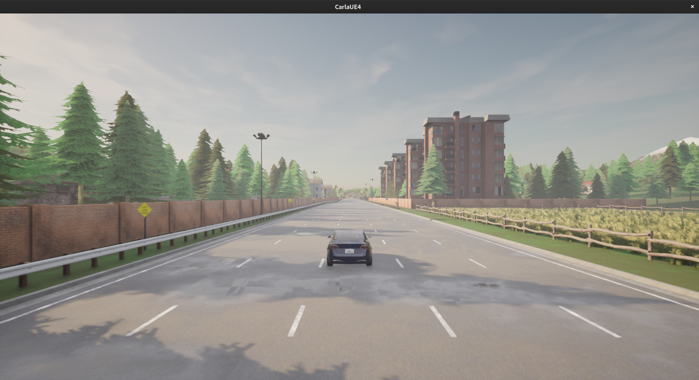

# Follow-a-Car Example

This example creates a scenario with two cars. One coach car and one
 student car behind the coach car. The client script drives the coach
 car forward for a period of time and stops afterwards. The user must
 fill in [`follow_a_car/controller.py`](follow_a_car/controller.py) to
 control the student car to follow the coach car and stop accordingly.

Please the the top-level [README](../README.md) to learn the usage.

